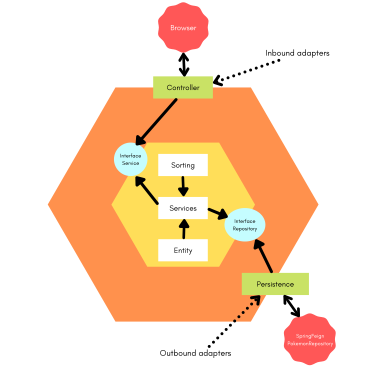

# PokeAPI
A REST API for **Pokémon** - [pokeapi.co](https://pokeapi.co)

## About

The project focuses on consuming the <b>REST</b> application from PokeAPI. Currently its only function is to abstract the list of objects from the return and transform it into a pokemon model to map their names. However, it is scalable for future updates, implementations, etc.

    
## Routes
| URL | Returns | Features |
| --- | --- | --- |
| **/pokemons** | All pokemons  | _Query support_|

## Params

- **Pokemon's** support params:

| URL | Type | Description |
| --- | --- | --- |
| **/pokemons?order=** | ['asc', 'length'] | _Order by Lexicographical or length_|
| **/pokemons?q=** | String | _Find pokemon by using params_|
| **/pokemons?highlight=** | Boolean | _Find one surprise highlight pokemon_|

## Hexagonal Architecture

## Author
| [ @weesftw](https://github.com/weesftw) |
| :---: |

## Technology

- [Spring](https://spring.io/)
- [Gradle](https://gradle.org/)
